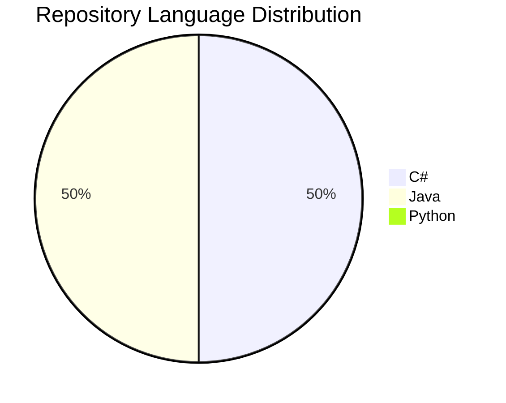
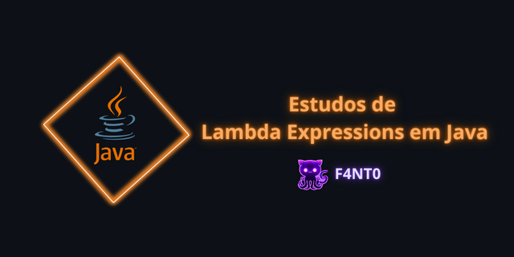
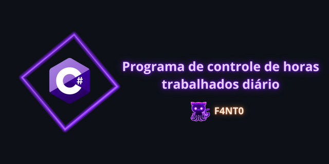

# $$\color{orange}\boxed{\color{#4CA64C}\mathtt{Fanto \space Documentations}}$$

  

---

Bem vindo a comunidade da página $\sf \color{lightgreen}Fanto \space Documentations$ do Instagram! 
  
Todos os projetos desenvolvidos pelo Engenheiro de Software $\sf \color{yellow}Gabriel \space Fanto \space Stundner$ e divulgados se encontram organizados aqui para facilitar encontrar os projetos pelos alunos e colegas de forma mais simples.

---

## $$\boxed{\sf \color{lightblue}Linguagens \space Utilizadas}$$

---

## $$\boxed{\sf \color{magenta}Últimos \space Publicados}$$

<table>
  <tr>
    <td></td>
    <td></td>
  </tr>
</table>
