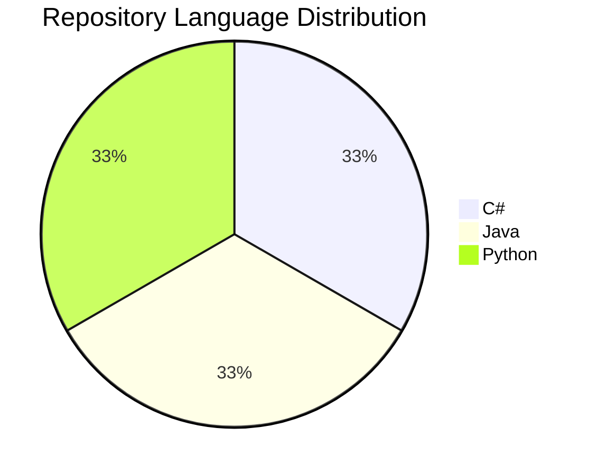

  

<table align="center">
  <tr>
    <td></td>
    <td><a href="https://github.com/sponsors/F4NT0"></td>
  </tr>
</table>

---

Bem vindo a comunidade de projetos desenvolvidos e explicados no Instagram $\color{pink}\sf \@ fanto \\_ docs$. 
  
Todos os projetos foram desenvolvidos pelo Engenheiro de Software $\sf \color{yellow}Gabriel \space Fanto \space Stundner$ e se encontram organizados aqui para facilitar encontrar os projetos com mais facilidade pela comunidade.
  
As versões encontradas aqui são as versões apresentadas pelo instagram, os projetos mais atualizados se encontram no perfil oficial do Github.

  
  
Clique na imagem acima para acessar o perfil oficial

---

## $$\boxed{\sf \color{lightblue}Linguagens \space Utilizadas}$$

---

## $$\boxed{\sf \color{magenta}Últimos \space Publicados}$$

<table>
  <tr>
    <td></td>
    <td></td>
  </tr>
</table>

---

   

